<section class="cover-hero" aria-labelledby="cover-title">
  

    
Kiwi Manual

    <h1 id="cover-title" class="cover-hero__word">KIWI</h1>
    
Single-Board Satellite

  

  <a class="cover-hero__scroll" href="#manual-start">Enter manual</a>
</section>

<section class="manual-sheet" id="manual-start" markdown="1">

### Description

Kiwi is a small and compact satellite that combines multiple sensors, radios and data storage solutions on a single printed circuit board (PCB).
It is designed to be accessible, programmable, and easily customizable through custom expansion boards.
Kiwi primarily designed for tabletop experiments, to be used as a tool in STEM education.

This document introduces Kiwi, and the functions it provides out-of-the-box.

This is a manual made easy to follow for people with some knowledge of technology and science.
Please look at the contact information section towards the end if you're interested in any further information or have questions!

### WARNINGS & Safety Measures!

Electrical devices connected to this product cannot be near any liquids
and/or high temperature environments (above 85°C, 185°F) as it can cause internal or
external damage to the product, your device connected to the product,
and/or even yourself. Kiwi is designed primarily to be powered over USB (5V), consuming
around 250 mW of power.

--- 

## TABLE OF CONTENTS
{: .no_toc }

* TOC
{:toc}

---

---

## Materials / Equipment Required

- The Kiwi satellite (provided)
- A USB-micro B cable (bring-your-own) to power the Kiwi
- A personal computer (desktop, laptop, MacBook or iMac, etc., bring-your-own) to view data coming from the Kiwi

---

---

# Get to know your Kiwi

### The Hardware

### The Firmware

### Data Visualization

---

---

# Powering up your Kiwi

-  Locate the USB port on your computer. 

  

  

- Plug in the USB-A side of the cable into the computer's USB Port. 
  Connect the micro-B side into the Kiwi (as shown).

  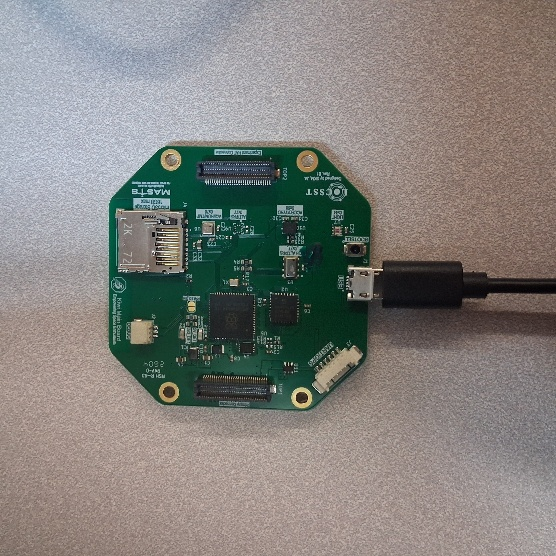

  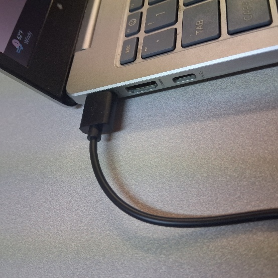

  At this point, the Kiwi is turned on, and by default, creates an open WiFi access point called `kiwi-ap`.
  Kiwi broadcasts various sensor measurements over WiFi at [UDP](https://en.wikipedia.org/wiki/User_Datagram_Protocol) port `8099`.

#### Troubleshooting
- Give it up to a minute for the WiFi network to show up.
- If the default `kiwi-ap` network does not show up, disconnect and reconnect the device.
- If the problem persists,
  - Optionally short the `PWLED_EN` jumper to verify both the red (5V power) and green (3.3V power) LEDs are lighting up.
  - Contact us.

# Connecting to Kiwi

By default, Kiwi transmits data through the self-hosted `kiwi-ap` WiFi access point.
To receive measurements from your Kiwi, you will need to use a WiFi-enabled computer. 
After the data visualization tool, Kiwi Plotter, has been set up on your computer, connect your computer to the `kiwi-ap` WiFi access point.

# Configuring your Kiwi

Kiwi exposes a simple configuration interface over [universal serial asynchronous receiver-transmitter (UART)](https://en.wikipedia.org/wiki/Universal_asynchronous_receiver-transmitter), better known as a ['serial port'](https://en.wikipedia.org/wiki/Serial_communication).
This serial port is accessible to the computer connected to Kiwi over the USB port.
The configuration interfaces uses text commands to configure the Kiwi.
The built-in firmware supports changing the WiFi settings, and updating the unique identifier of the Kiwi (`Kiwi#XXXX` by default).

## Connecting to Serial Port

### CoolTerm
[CoolTerm](https://freeware.the-meiers.org/) is a free software that provides an interface to communicate with a device over the serial port.
Depending on your operating system, use the links in the following table to get the correct version of CoolTerm.
For most users, the first (Windows users) and second (Mac users) should be sufficient.

|--|--|
| Computer | Operating System | Architecture | Link |
|--|--|
| Windows PC / Laptop | Windows 64-bit | `x86_64` | [Link](https://freeware.the-meiers.org/CoolTermWin64Bit.zip) |
| MacBook / iMac | macOS (Universal) | `x86_64` / `arm64` | [Link](https://freeware.the-meiers.org/CoolTermMac.dmg) |
| Windows PC / Laptop (before 2010) | Windows 32-bit | `x86` / `i686` | [Link](https://freeware.the-meiers.org/CoolTermWin32Bit.zip) |
| Windows PC / Laptop with Snapdragon Chip | Windows ARM64 | `arm64` | [Link](https://freeware.the-meiers.org/CoolTermWinARM64Bit.zip) |
| Linux PC / Laptop | -- | -- | [32-bit](https://freeware.the-meiers.org/CoolTermLinux32Bit.zip) [64-bit](https://freeware.the-meiers.org/CoolTermLinux64Bit.zip) |
| Raspberry Pi | -- | -- | [32-bit](https://freeware.the-meiers.org/CoolTermRaspberryPi.zip) [64-bit](https://freeware.the-meiers.org/CoolTermRaspberryPi64Bit.zip) |

### Windows PC

## Available Commands
### `help`

## Configuring Kiwi on a Windows PC
Before you can configure the Kiwi using your connected Windows PC (or laptop), you need to obtain a piece of software that allows your computer to communicate with serial devices, called [PuTTY](https://www.chiark.greenend.org.uk/~sgtatham/putty/latest.html).
*Step 2*: Go to the website Putty.org

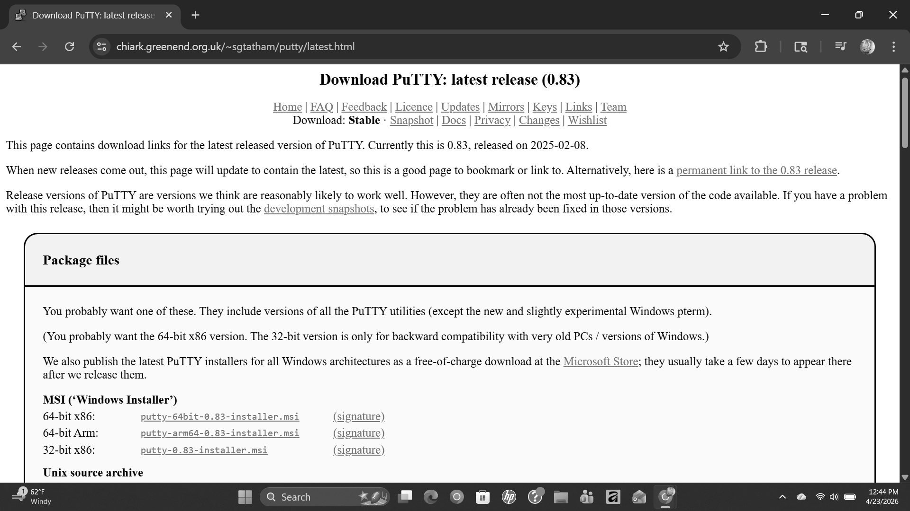

*Step 3*: Out of the top three options, Download either:

- “64-bit x86" if you have a windows intel or amd
- “64-bit" arm if you have a snapdragon

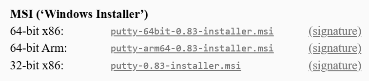

*Step 4*: Press windows key and type in “device manager” then open it

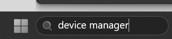

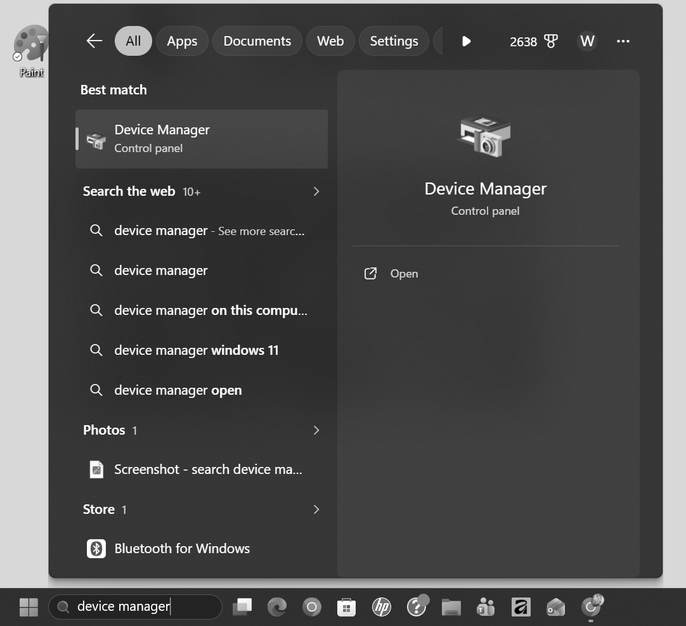

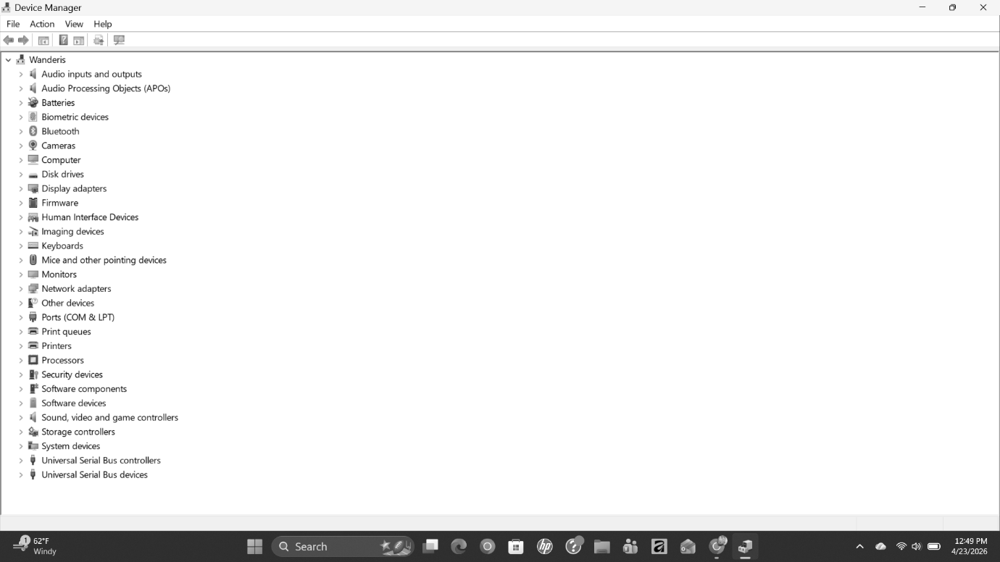

*Step 5*: In device manager go to “PORTS (COM & LPT)” and expand it

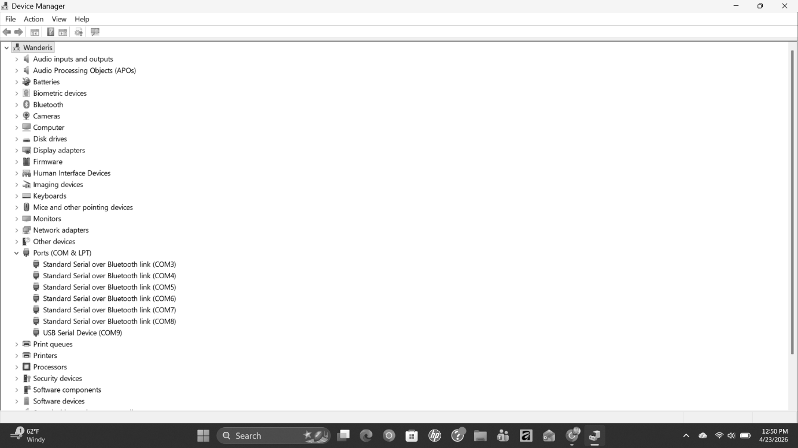

*Step 6*: Take note of USB Serial Device (COMx)
- If you have multiple usb serial devices:
  - Double click each of them to open
  - Go to the "Details" tab
  - In the "property" dropdown; select "device instance path" and the
    correct kiwi device starts with “USB\VID_C001&PID_BEE5” and note the
    COMx of this device

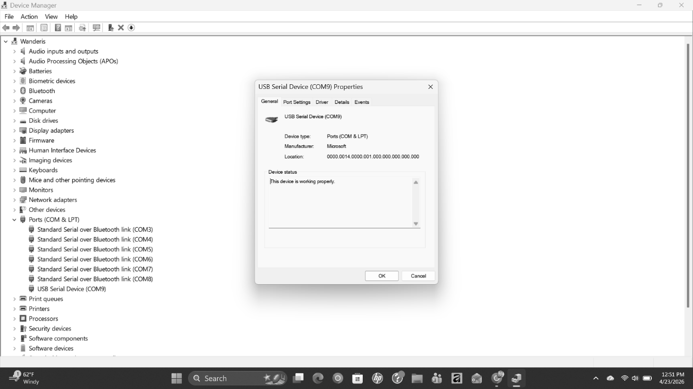

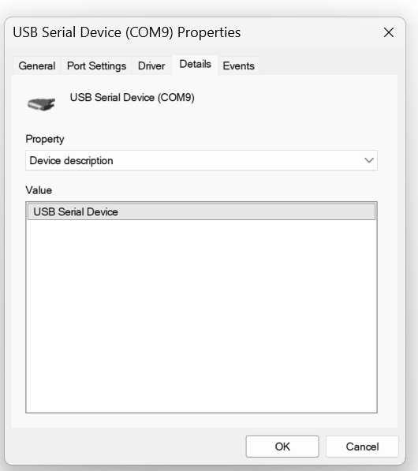

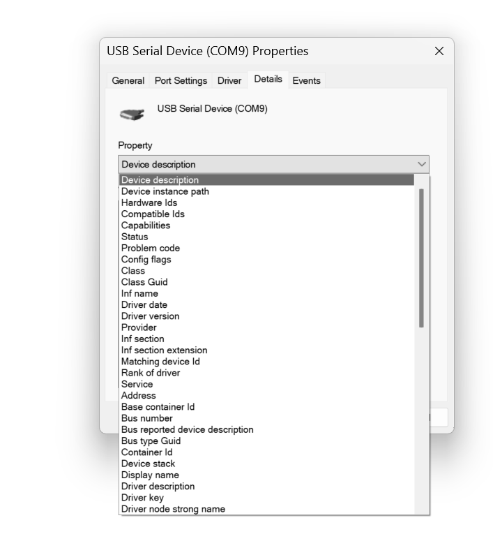

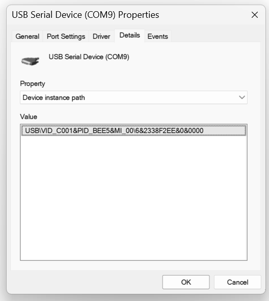

*Step 7*: Press windows key and go to “Putty” then open it

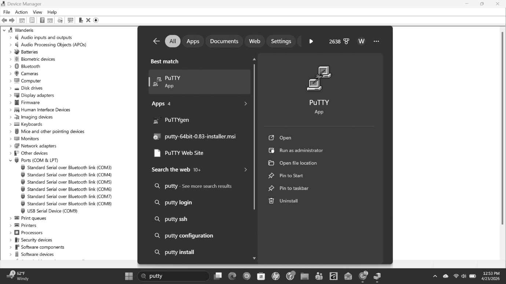

*Step 8*: After opening putty, this will show up. Select “serial
connection” and enter your COM number into “serial” line box

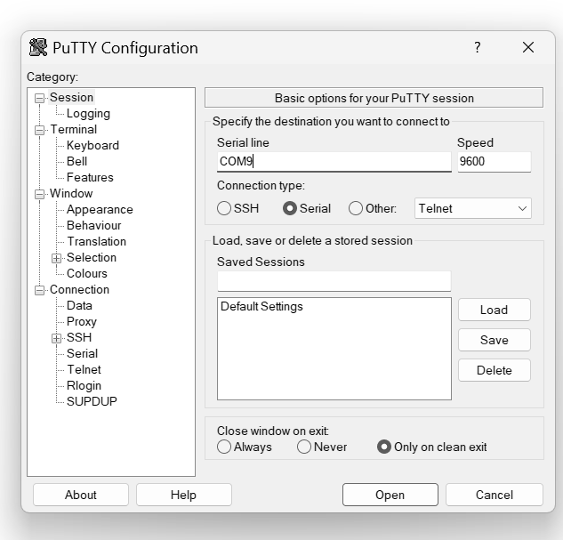

*Step 9*: Hit “Open”, which will send you to the serial console where
you type in “help” and press “enter” to get help.

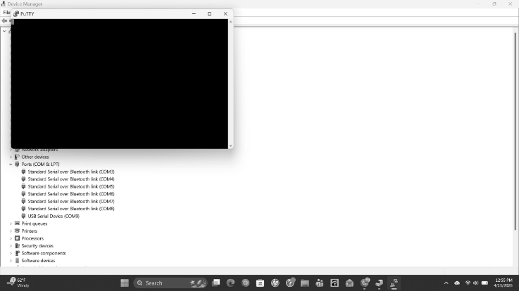

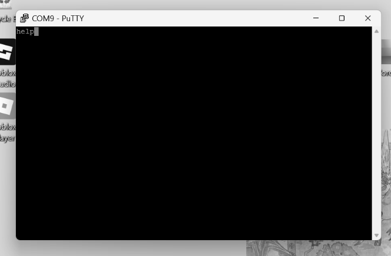

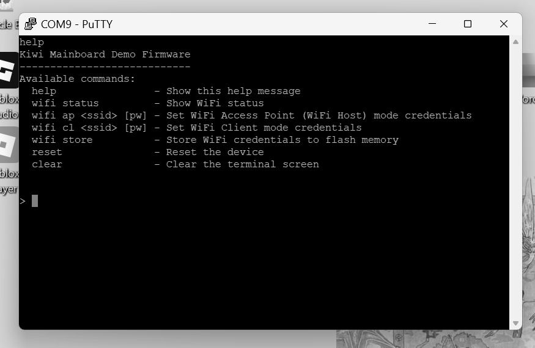

### Step by Step Installation Process (Part 1) — Mac Version

*Materials*: 

Mac with type c port needs a type c/micro b cable (NOT pprovided)

**OR**

Type C/type A adapter + type A/micro B cable (these port cables are NOT
provided)

with type c/micro b cable: Microb cable goes into the kiwi and the type c into the mac port

with type A adapter: type c into mac port, type a into type a adapter and micro b cable into the kiwi

After connecting the kiwi to your Mac, something like this will show
up:

“Allow accessory to connect? Do you want to connect LoCSST/SKM Kiwi
Mainboard Rev. X to this Mac?”\
You must press “Allow”

Next, open terminal
- Command + space / invoke spotlight search and search “terminal” then
  open terminal
- Go to applications -> utilities then open terminal

Then, Type “sudo screen /dev/cu.usbmodem\<Tab\>” which autocompletes to “sudo screen /dev/cu.usbmodem2025_00011” then put a space and add the number “115200” then press return.

If you’re asked for a password, then type in the password that you use
to log into your Mac.

Then type in “help” to get help.

</section>

