<section class="cover-hero" aria-labelledby="cover-title">
  

    

      <h1 id="cover-title" class="cover-hero__word">KIWI</h1>
      
The Single-board Satellite

    

    

      

      
    

    
MANUAL

  

  <a class="cover-hero__scroll" href="#manual-start">Enter manual</a>
</section>

<section class="manual-sheet" id="manual-start" markdown="1">

# Description

Kiwi is a small and compact satellite that combines multiple sensors, radios and data storage solutions on a single printed circuit board (PCB).
It is designed to be accessible, programmable, and easily customizable through custom expansion boards.
Kiwi primarily designed for tabletop experiments, to be used as a tool in STEM education.

This document introduces Kiwi, and the functions it provides out-of-the-box.

This is a manual made easy to follow for people with some knowledge of technology and science.
Please look at the contact information section towards the end if you're interested in any further information or have questions!

> **WARNINGS & Safety Measures**
> Electrical devices connected to Kiwi cannot be near any liquids and/or high temperature environments (above 85°C, 185°F) as it can cause internal or external damage to the Kiwi, your device connected to the Kiwi, and/or even yourself.
> Kiwi is designed primarily to be powered over USB (5V), consuming around 250 mW of power.
> 
> Kiwi is an exposed PCB, with electronic components sensitive to static discharge.
> Use caution while handling.
{: .callout-warning }

</section>

<section class="manual-sheet" markdown="1">

# TABLE OF CONTENTS
{: .no_toc }

* TOC
{:toc}

</section>

<section class="manual-sheet" markdown="1">

# Materials / Equipment Required

- The Kiwi satellite (provided)
- A USB-micro B cable (bring-your-own) to power the Kiwi
- A personal computer (desktop, laptop, MacBook or iMac, etc., bring-your-own) to view data coming from the Kiwi

</section>

<section class="manual-sheet" markdown="1">

# Get to know your Kiwi

Kiwi is a single-board satellite.
Meaning, it is a single, printed-circuit board (PCB) with different components attached to it that perform different functions.
The following sections will introduce you to various parts of a Kiwi - some that are visible, and some that are not.

### The Hardware

The interactive diagram below shows the front and back of the Kiwi PCB.
Click the rectangle around a component to see its designation, part number, and description.

  <iframe src="{{ '/assets/media/kiwi-pcb-viewer.html' | relative_url }}"
          title="Kiwi PCB Interactive Viewer"
          loading="lazy"
          scrolling="no"
          id="pcb-viewer-frame"
          onload="this.style.height=(this.contentWindow.document.body.scrollHeight+32)+'px'; (function(f){window.addEventListener('message',function(e){if(e.data&&e.data.type==='pcb-resize')f.style.height=(e.data.height+32)+'px';});})(this);">
  </iframe>

The central component of the Kiwi is the Raspberry Pi RP2350B microcontroller, which serves as the "brain" of Kiwi, managing its operations in processing sensor data and handling communications.
Kiwi contains a 2 MiB (1 MiB = 1024 KiB = 1024 &times; 1024 bytes) flash memory chip, which is used to store the software program executed by the microcontroller.
Additional peripherals can be stacked on top of Kiwi through the 60-pin expansion sockets (`TOP1` and `TOP2`) and plugs (`BOT1` and `BOT2`).
Kiwi also contains a variety of sensors, including an accelerometer, gyroscope, magnetometer, barometer, temperature sensor, air quality index (AQI) and humidity sensor, and light sensors on each side of the board.
Kiwi has a built-in Wi-Fi (2.4 GHz) radio for wireless communication, and a USB port for power and configuration updates.
There is also an on-board micro-SD card slot for additional data storage.

### The Firmware

[Firmware](https://en.wikipedia.org/wiki/Firmware) is the software that runs on the microcontroller on-board the Kiwi, controlling its hardware functions and defining its operations.
Kiwis come preloaded with a firmware that provides the basic functionality of reading out various sensor measurements, and broadcasting them over Wi-Fi.

The firmware is upgradable (requires a computer and the [Raspberry Pi Debug Tool](https://www.raspberrypi.com/documentation/computers/debug-tool/)).
Custom firmware can also be developed and flashed onto the Kiwi, allowing for custom behavior and functionality.
A [MicroPython](https://micropython.org/) interpreter is also available for the Kiwi, allowing users to write and execute Python code directly on the device.

</section>

<section class="manual-sheet" markdown="1">

# Powering up your Kiwi

-  Locate the USB port on your computer. 

  {: #fig-usb-port-pc style="filter: invert(1); width: 40%" }

  {: #fig-usb-cable style="filter: invert(1); width: 40%" }

- Plug in the USB-A side of the cable into the computer's USB Port ().
  Connect the micro-B side into the Kiwi (as shown in ).

  {: #fig-usb-plugged-pc style="width: 60%" }

  {: #fig-usb-plugged-kiwi style="width: 60%" }

  At this point, the Kiwi is turned on, and by default, creates an open Wi-Fi access point called `kiwi-ap`.
  Kiwi broadcasts various sensor measurements over Wi-Fi at [UDP](https://en.wikipedia.org/wiki/User_Datagram_Protocol) port `8099`.

> **Note**
> If you are using a MacBook or iMac, or a Windows PC without an accessible USB type-A port, you may need a USB-C to USB-A adapter to connect the USB cable to your computer.
> Optionally, you can also use a [USB-C to micro-B cable](https://www.adafruit.com/product/3878) to connect the Kiwi directly to your Mac or PC without an adapter.
{: .callout-note }

> **Troubleshooting**
> - Give it up to a minute for the Wi-Fi network to show up.
> - If the default `kiwi-ap` network does not show up, disconnect and reconnect the device.
> - If the problem persists,
>   - Short the `PWLED_EN` jumper to verify both the red (5V power) and green (3.3V power) LEDs are lighting up.
>   - Write to us at [kiwi@uml.edu](mailto:kiwi@uml.edu).
{: .callout-tip }

</section>

<section class="manual-sheet" markdown="1">

# Receiving Data from your Kiwi

By default, Kiwi transmits data through the self-hosted `kiwi-ap` Wi-Fi access point.
To receive measurements from your Kiwi, you will need to use a Wi-Fi-enabled computer. 
After the data visualization tool, Kiwi Plotter, has been set up on your computer, connect your computer to the `kiwi-ap` Wi-Fi access point.

</section>

<section class="manual-sheet" markdown="1">

# Configuring your Kiwi

Kiwi exposes a simple configuration interface over [universal serial asynchronous receiver-transmitter (UART)](https://en.wikipedia.org/wiki/Universal_asynchronous_receiver-transmitter), better known as a ['serial port'](https://en.wikipedia.org/wiki/Serial_communication).
This serial port is accessible to the computer connected to Kiwi over the USB port.
The configuration interfaces uses text commands to configure the Kiwi.
The built-in firmware supports changing the Wi-Fi settings, and updating the unique identifier of the Kiwi (`Kiwi#XXXX` by default).

## Connecting to Kiwi Serial Port

### CoolTerm
[CoolTerm](https://freeware.the-meiers.org/) is a free software that provides an interface to communicate with a device over the serial port.
Depending on your operating system, use the links in the following table to get the correct version of CoolTerm.
For most users, the first (Windows users) and second (Mac users) should be sufficient.

CoolTerm download options by platform and CPU architecture.

|--|--|
| Computer | Operating System | Architecture | Link |
|--|--|
| Windows PC / Laptop | Windows 64-bit | `x86_64` | [Link](https://freeware.the-meiers.org/CoolTermWin64Bit.zip) |
| MacBook / iMac | macOS (Universal) | `x86_64` / `arm64` | [Link](https://freeware.the-meiers.org/CoolTermMac.dmg) |
| Windows PC / Laptop (before 2010) | Windows 32-bit | `x86` | [Link](https://freeware.the-meiers.org/CoolTermWin32Bit.zip) |
| Windows PC / Laptop with Snapdragon Chip | Windows ARM64 | `arm64` | [Link](https://freeware.the-meiers.org/CoolTermWinARM64Bit.zip) |
| Linux PC / Laptop | Linux | `x86` / `x86_64` | [32-bit](https://freeware.the-meiers.org/CoolTermLinux32Bit.zip) [64-bit](https://freeware.the-meiers.org/CoolTermLinux64Bit.zip) |
| Raspberry Pi | Linux | `armv7` / `arm64` | [32-bit](https://freeware.the-meiers.org/CoolTermRaspberryPi.zip) [64-bit](https://freeware.the-meiers.org/CoolTermRaspberryPi64Bit.zip) |
{: #tbl-coolterm }

### Windows PC
{: .collapsible .collapsible-open}
<!-- {: .collapsible} -->
#### Installation
- Download the version of CoolTerm compatible with your Windows PC from .
- Navigate to the location where the file was downloaded on 
- Extract the files from the downloaded `.zip` archive.
  - Right click on the `.zip` archive to open the context menu and select the "Extract All..." option.
    {% include os-toggle.html id="fig-coolterm-extract" src1="assets/media/windows/coolterm_extract_win11.png" alt1="Extract CoolTerm (Windows 11)" src2="assets/media/windows/coolterm_extract_win10.png" alt2="Extract CoolTerm (Windows 10)" label1="Windows 11" label2="Windows10" style="width: 100%" collapsible=true %}
  - Click the "Extract" button in the extraction dialog.
    {: .collapsible style="width: 60%" }
  - Navigate into the extracted `CoolTermWin64Bit` directory, and launch the `CoolTerm` executable.
    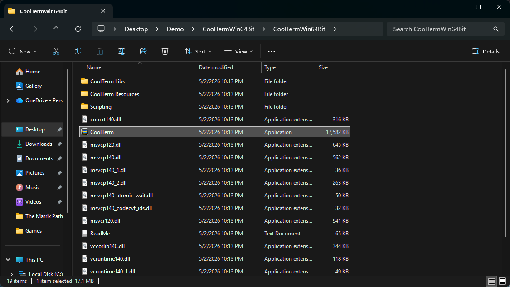{: .collapsible style="width: 80%" }

#### Usage
- Upon launching CoolTerm, you will be prompted to set the preferences for CoolTerm. Use default preferences.
  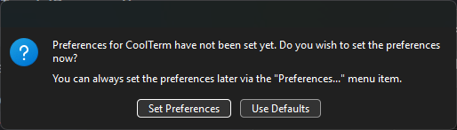
- After CoolTerm opens, click on "▼" on the left of the bottom bar.
- Select a serial port under "Port". Your computer may have multiple serial connections available depending on which peripherals are connected to it.
  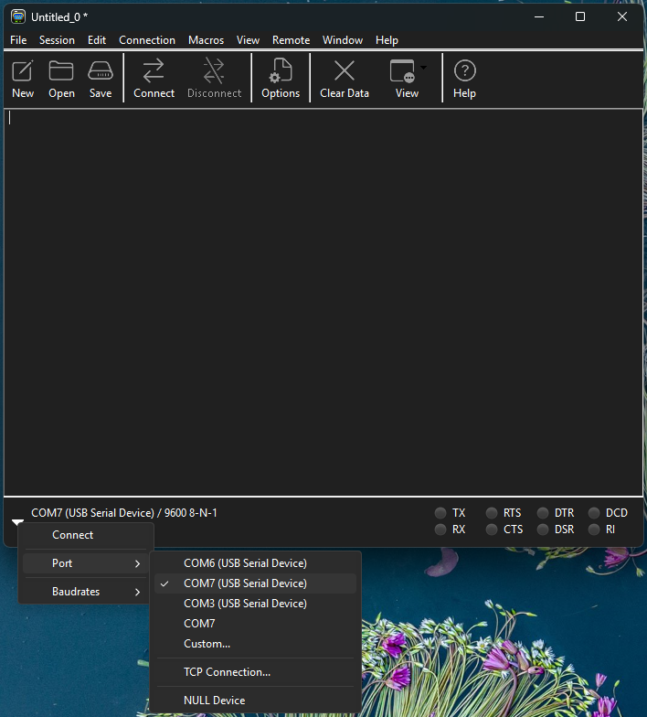
- Click "Connect" to connect to the Kiwi serial port.
  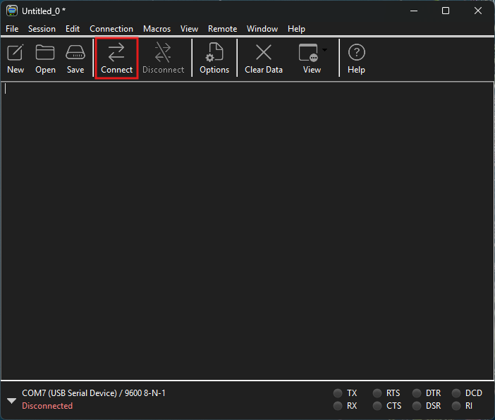{: .collapsible }
  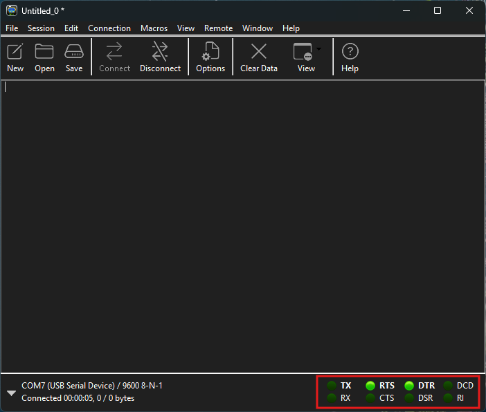{: .collapsible }
- Hit the <kbd>Enter</kbd> key. You should see a prompt that looks like `> `, which indicates you are connected to the Kiwi serial console, and your Kiwi is ready to receive commands.
  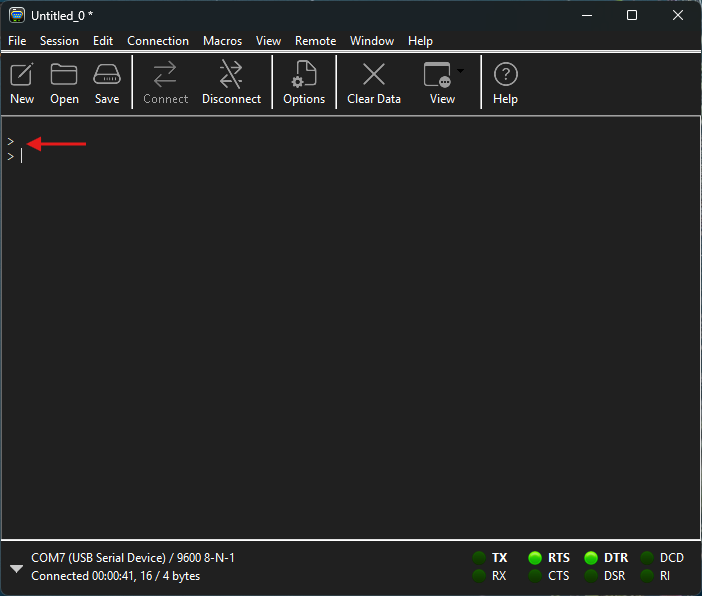
- If the `> ` does not show up and you have multiple serial devices under "Ports", switch to a different port, connect to it, and hit <kbd>Enter</kbd>.
- Type `help` and hit <kbd>Enter</kbd> to see the list of available commands.
  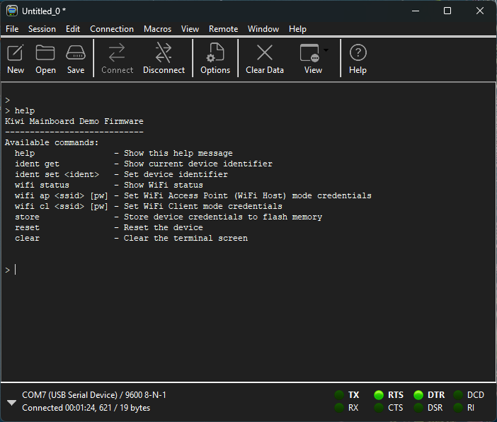

> **Identify the Kiwi COM Port**
> The COM port presented by Kiwi can be identified in the `Device Manager` program in case multiple COM ports are present.
> To open Device Manager, first click on the 'Start' () button on your desktop, or the <kbd>Windows </kbd> key on your keyboard.
> Then, type in 'device manager', and 'Device Manager (Control Panel)' should show up in the search results.
> 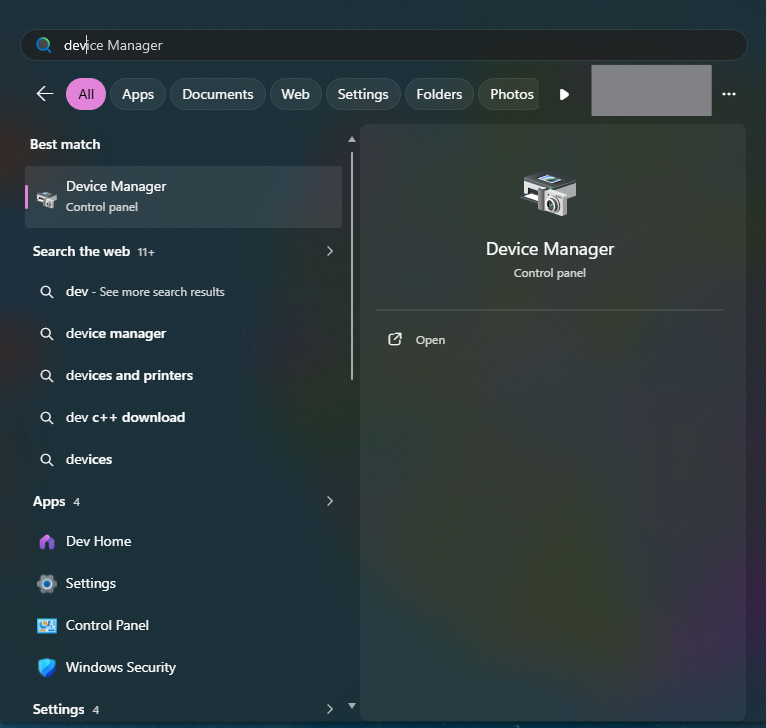{: style="width: 60%" .collapsible }
> Open Device Manager, and navigate to <ui-menu>Ports (COM & LPT)</ui-menu> in the device tree.
> 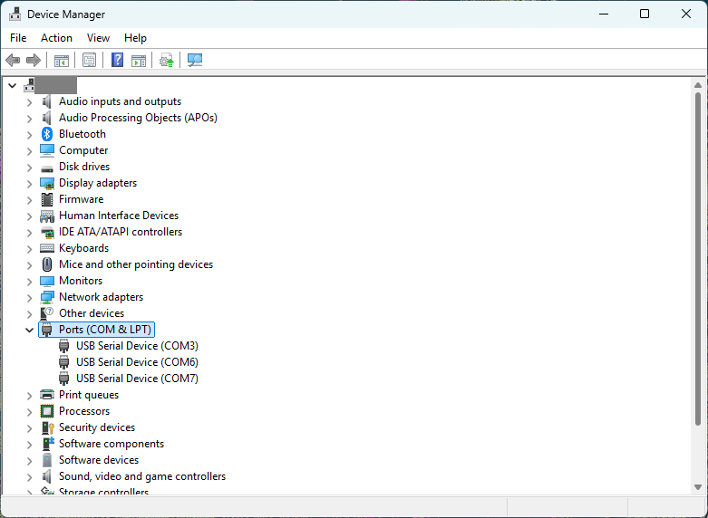{: .collapsible }
> Then, right click on a COM port under the <ui-menu>Ports (COM & LPT)</ui-menu> devices and select **Properties**.
> 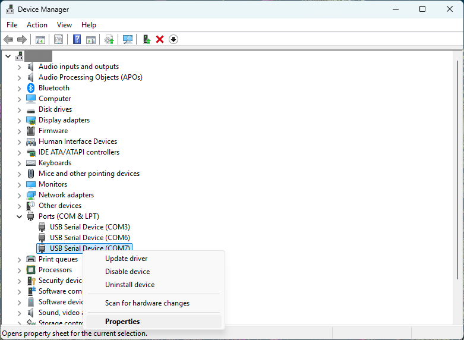{: .collapsible }
> In the device properties dialog box, navigate to <ui-tab>Details</ui-tab>, and select <ui-btn>Bus reported device description</ui-btn> under the <ui-menu>Property</ui-menu> dropdown. A Kiwi will report itself as `Kiwi Mainboard Rev. B`.
> 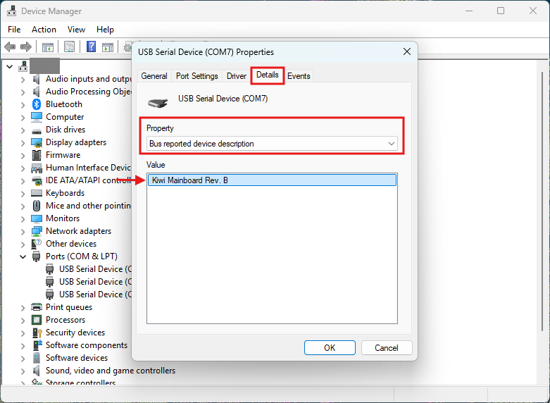
> Note the COM port number once the Kiwi is found. Hit 'OK' to close the Properties dialog box, and close Device Manager.
{: .callout-tip .collapsible }

### MacBook / iMac
{: .collapsible}
#### Installation
- Download the macOS version of CoolTerm from .
- Open the downloaded `CoolTermMac.dmg` file, and drag the CoolTerm application to your Applications folder.
  {: style="width: 60%" }

#### Usage
- Open CoolTerm from the Applications folder.
  On first launch, you will be prompted to set up the preferences for CoolTerm.
  Use the default settings (press "Use Defaults" button).
  {: style="width: 40%" }
- After CoolTerm opens, click on "▼" on the left of the bottom bar.
- Select the serial port that corresponds to your Kiwi (e.g., `usbmodem2025_0011`) under "Port".
- In the "▼" menu, click "Connect" to connect to the Kiwi serial port.
- Hit the <kbd>Return</kbd> key. You should see a prompt that looks like `> `, which indicates you are connected to the Kiwi serial console, and your Kiwi is ready to receive commands.
- Type `help` and hit <kbd>Return</kbd> to see the list of available commands.

<figure style="width: 80%; margin: 1.5rem auto">
  <video controls style="width: 100%; margin: 0; border-radius: 1rem">
    <source src="{{ '/assets/media/coolterm-mac-connect.mp4' | relative_url }}" type="video/mp4">
  </video>
  <figcaption>Connecting to the Kiwi serial port on macOS using CoolTerm.</figcaption>
</figure>

## Available Commands

#### `help`

</section>

<nav class="anchor-nav" aria-label="Section navigation">
  <button type="button" class="anchor-nav__btn anchor-nav__btn--prev" id="anchor-prev" aria-label="Go to previous section">
    ◀
    Previous section
  </button>
  <button type="button" class="anchor-nav__btn anchor-nav__btn--next" id="anchor-next" aria-label="Go to next section">
    Next section
    ▶
  </button>
</nav>

